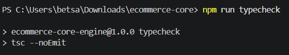

**Практична робота № 2** — «Базові засоби системи типів TypeScript».
**Варіант 1** — Електроніка та гаджети.

## Опис проєкту

Проєкт моделює предметну область e-commerce застосунку:

- **Рівень 1** — базові типи (EntityId, BaseProduct, Product, кортеж DeviceSpecs) та функції каталогу (createProduct, calculateLineTotal) з валідацією вхідних даних.
- **Рівень 2** — літеральні типи (OrderStatus, DeliveryMethod), перетин типів (Order = ... & TimestampMetadata), чиста функція updateOrderStatus з захистом термінальних статусів, безпечна обробка unknown через validateCustomerInput.
- **Рівень 3** — розпізнавані об'єднання способів оплати (PaymentDetails), користувацький захисник типу isCreditCardPayment, маскування карток maskCardNumber, процесинг оплати processPayment з вичерпною перевіркою (never) у гілці default.

### Специфіка варіанта 1 (Електроніка та гаджети)

| Поле | Тип |
|---|---|
| warrantyMonths | number |
| powerWatts | number (опціонально) |
| specs | кортеж [cpu: string, ramGb: number] |
| DeliveryMethod | 'courier' \| 'post_locker' \| 'store_pickup' |

## Технічне забезпечення

- Node.js 18+ (LTS), npm
- TypeScript (tsc), tsx
- tsconfig.json у суворому режимі: strict: true, noImplicitAny: true, strictNullChecks: true, noUncheckedIndexedAccess: true, target: ES2022, module: NodeNext

## Інструкція запуску

# 1. Встановити залежності
npm install

# 2. Перевірити типи без компіляції (опційно)
npm run typecheck

# 3. Запустити демонстрацію
npm start

## Приклад виведення програми

=== СИСТЕМА ОБРОБКИ ЗАМОВЛЕНЬ (E-COMMERCE CORE) ===

[Каталог товарів]
- Створено товар #1: [Ноутбук Pro 16] - 45000 грн (В наявності: так)
  Специфікації: CPU: M3 Max, RAM: 36GB, Гарантія: 24 міс.
- Створено товар #2: [Бездротова миша] - 1200 грн (В наявності: так)

[Формування кошика]
1. Ноутбук Pro 16 x 1 = 45000 грн
2. Бездротова миша x 2 = 2400 грн

Загальна вартість замовлення: 47400 грн

[Створення замовлення]
Замовлення ID: ord-98214-abc
Клієнт: customer@example.com
Доставка: courier
Початковий статус: pending

[Зміна життєвого циклу]
Оновлення статусу: pending -> processing
Оновлення статусу: processing -> shipped

[Процесинг платежу]
Метод оплати: card
Маскування: **** **** **** 8821
Результат: Успішно списано 47400 грн з картки платника John Doe.

## Скріншоти роботи програми

### Успішна перевірка типів (`npm run typecheck`)

Скриншот демонструє відсутність помилок компіляції у суворому режимі TypeScript.

### Запуск програми (`npm start`)

Скриншот 1 — каталог товарів, формування кошика та створення замовлення:

Скриншот 2 — зміна статусів замовлення та процесинг оплати (картка, готівка, онлайн-сервіс):

Скриншот 3 — демонстрація обробки некоректних вхідних даних (очікувані помилки):

## Контрольні питання — короткі тези для усного захисту
1. **TS vs JS:** TypeScript додає статичну типізацію поверх JS; під час компіляції (tsc) усі типи **стираються** (type erasure) — у виконуваному JS-коді анотацій типів немає.
2. **`strict: true`:** вмикає весь пакет суворих перевірок одразу. noImplicitAny забороняє змінні без явного чи виведеного типу (запобігає «діркам» у типізації); strictNullChecks розглядає null/undefined як окремі типи, які потрібно явно обробляти.
3. **`any` vs `unknown`:** any повністю вимикає перевірку типів (можна викликати будь-що). unknown — теж «будь-яке значення», але компілятор **забороняє** з ним операції, доки тип не звужено (typeof, in, type guard) — це безпечніше.
4. **Tuple vs Array:** масив (number[]) — довільна кількість елементів одного типу; кортеж ([string, number]) — фіксована довжина, і кожна позиція має власний, наперед відомий тип.
5. **Union vs Intersection:** union (|) — значення належить **одному з** перелічених типів («або-або»); intersection (&) — значення поєднує **всі** властивості одразу («і-і»). Приклад: type Id = string | number проти type Full = A & B.
6. **Discriminated union:** об'єднання інтерфейсів зі спільним літеральним полем (дискримінатором, напр. type), за значенням якого компілятор однозначно звужує тип у switch/if.
7. **Type guard:** функція-предикат виду function isX(v: T): v is X, яка після виклику в умові звужує тип значення в поточній гілці коду.
8. **`never` + exhaustiveness check:** у гілці default змінній типу never присвоюється необроблене значення юніону; якщо в юніон додати новий варіант і забути обробити його у switch, TypeScript видасть помилку компіляції ще до рантайму.
